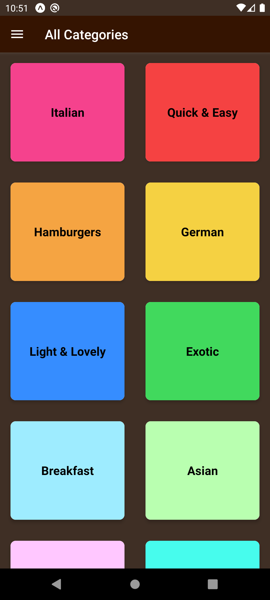
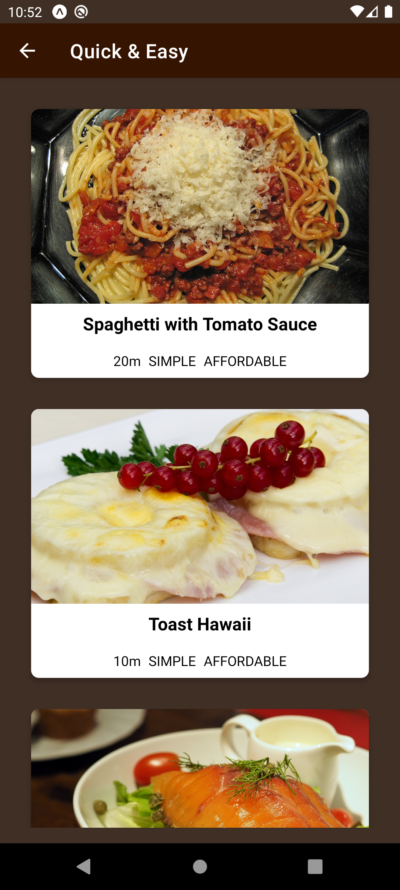
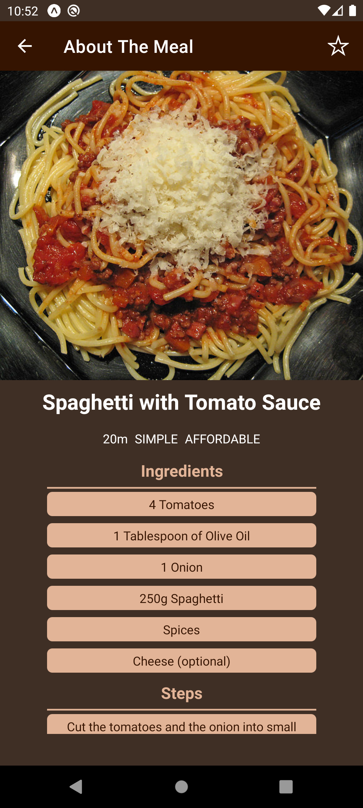
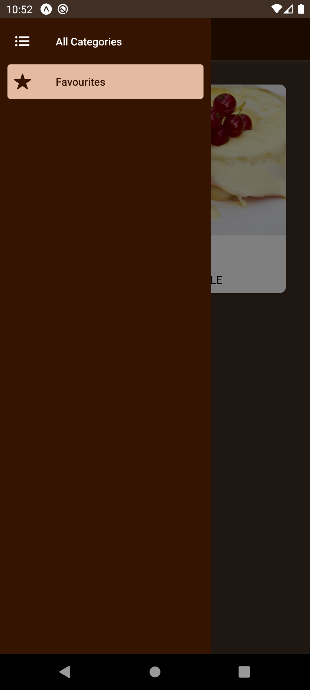

# RN-meals-app

Welcome to the GitHub repository for our React Native mobile app! This app is designed to showcase a delightful selection of meals with their respective categories and detailed information. Users can easily explore various meal options and discover their favorite dishes.

Key Features:

+ Browse a diverse menu of meals organized into different categories.

+ Access detailed information about each meal, including ingredients and preparation methods.

+ Enjoy the ability to mark meals as favorites for quick access to your preferred options.

+ Built using React Native and Redux, ensuring a smooth and efficient user experience.

App Screenshots:

